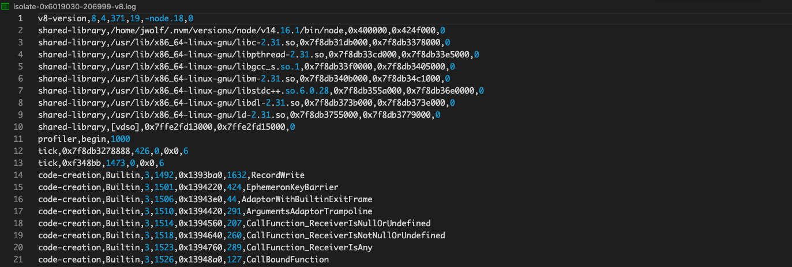
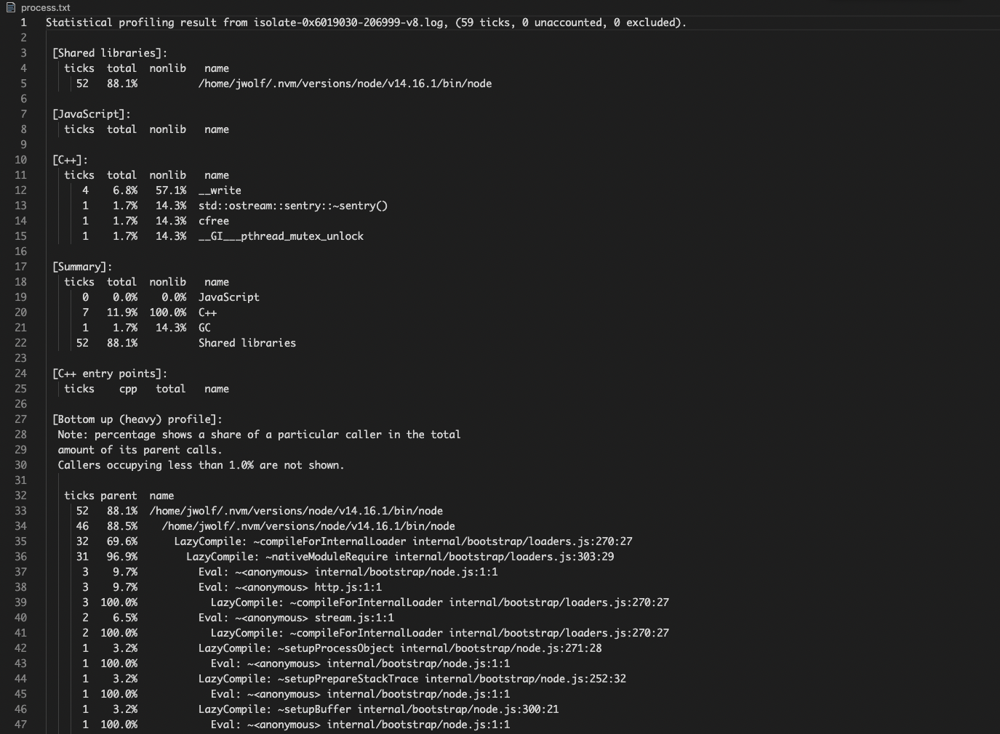
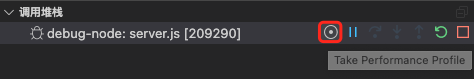
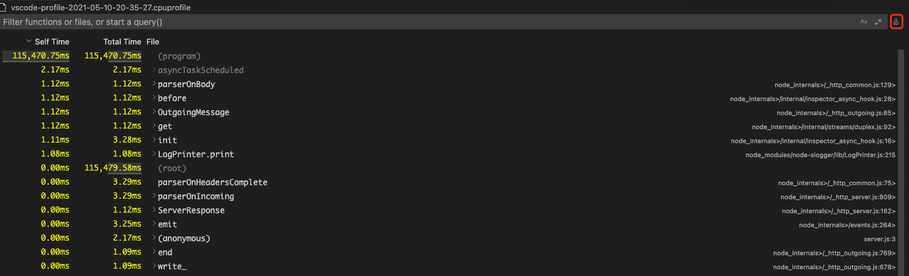
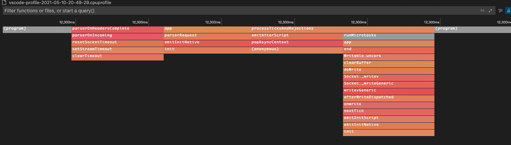

# 本地性能分析方法 <!-- {docsify-ignore} -->

## Easy profiling

> [文档地址](https://nodejs.org/en/docs/guides/simple-profiling/)

```shell
# 使用 --prof 参数启动服务
node --prof app.js
# 请求接口后 ctrl+c
# 将v8日志转成txt
node --prof-process isolate-*.log > processed.txt
```

注：isolate-*.log文件内容，如下图：
  

注：processed.txt文件内容，如下图：
  

## vscode-js-profile-flame

> 在vscode中，安装此插件来分析

1. 配置.vscode/launch.json

   注：${file} 代表当前tab获得焦点的文件， 具体预定义变量([文档地址](https://code.visualstudio.com/docs/editor/variables-reference))

   ```json
   {
     "version": "0.2.0",
     "configurations": [
       {
         "type": "pwa-node",
         "request": "launch",
         "name": "debug-node",
         "skipFiles": [
           "<node_internals>/**"
         ],
         "program": "${file}",
         "outputCapture": "std",
         "console": "internalConsole",
         "internalConsoleOptions": "openOnFirstSessionStart"
       }
     ]
   }
   ```

2. 使用vscode debug启动文件，选择debug-node后，点击下图按钮

   

   此时出现debug操作栏 

   

3. 在debug栏找到调用堆栈，点击下图按钮，即可开启cpu探查

   

   并且debug操作栏上会多一个小红点

   

4. 等到结束debug或者点击小红点，会在当前目录下生成一个 vscode-profile-xxxxx.cpuprofile 的文件， 点击vscode-profile-xxxxx.cpuprofile文件，会显示如下图：

   

   上图，是调用栈和耗时情况，点击上图右上角🔥按钮，即可展示火焰图，效果如下：

   

