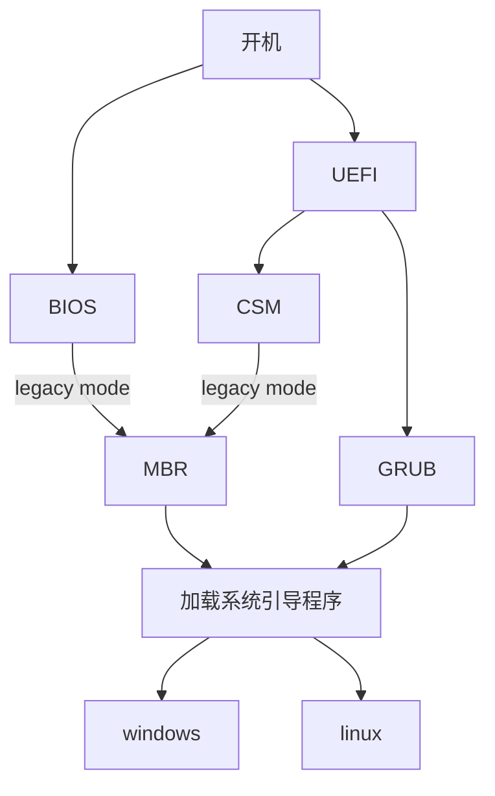

# Boot Loader (系统引导)

## 开机执行过程



## MBR 启动引导（传统模式）

MBR（Master Boot Record），主引导记录，也被称为`主引导扇区`。

如果采用MBR引导系统，会遵循如下一些约定，磁盘会被这样配置：

1. 磁盘的前512Byte数据，被存放MBR引导数据。
2. MBR的数据分三部分：
    - 0 ~ 445，最多446字节，记录引导代码
    - 446 ~ 509，最多4个硬盘分区表项，每个16Byte大小
        - 4个分区表项范围
            - 446 ~ 461，记录第1分区表
            - 462 ~ 477，记录第2分区表
            - 478 ~ 493，记录第3分区表
            - 494 ~ 509，记录第4分区表
        - 每个分区表项的结构如下（16Byte的分配情况）
            - 1Byte：激活标志（Active Flag）
            - 3Byte：CHS（Cylinder-Head-Sector）地址，用于指定分区的起始位置
            - 1Byte：分区类型，表示分区的文件系统类型
            - 3Byte：CHS地址，用于指定分区的结束位置
            - 4Byte：LBA（Logical Block Addressing）地址，用于指定分区的起始位置
            - 4Byte：分区的扇区数（长度）
    - 510 ~ 511，主引导记录约定的结束标志位，正常状态(0x55,0xAA)，如该标志改变，将无法识别MBR数据，硬盘会被认为是非MBR的硬盘

主要由BIOS，直接加载启动，或者由UEFI的CSM模块，基于EFI环境，模拟BIOS环境，加载启动。

## UEFI 启动引导（新的引导模式）

(U)EFI（Unified Extensible Firmware Interface），(通用)可扩展固件接口。

关于(U)EFI的解释：

1. EFI最初的标准由Intel提出，并被设计为替代传统的BIOS（Basic Input/Output System）。
2. EFI定义了一种用于操作系统加载的新型固件接口。
3. EFI支持32位和64位系统，并提供了更强大的扩展性，允许固件加载更多的驱动和应用程序。
4. UEFI是EFI的进一步发展，是一个行业联盟（UEFI Forum）维护的固件标准。
5. UEFI更加通用，不再仅限于Intel架构，也适用于其他处理器架构。
6. UEFI是EFI的扩展和推广版本，UEFI引入了更多的功能和特性，例如网络堆栈、安全启动、预启动环境等。

如果使用UEFI引导系统，会遵循如下一些约定（EFI规范要求），磁盘会被这样配置：

1. 磁盘需要创建一个ESP（EFI System Partition）分区。
2. ESP分区的位置可以是任何位置，一般位于磁盘的第一个分区。
3. ESP分区的文件系统格式，必须是FAT32货VFAT。
4. ESP分区必须包含一个名为`\EFI\`的目录，其中存放了引导加载器和操作系统相关的启动文件。通常，引导加载器的路径是`\EFI\BOOT\bootx64.efi`（对于64位系统）。

UEFI由以下几个部分组成：

1. Pre-EFI初始化模块
2. EFI驱动程序执行环境
3. EFI驱动程序
4. 兼容性支持模块（CSM）
5. EFI高层应用
6. GUID磁盘分区表

UEFI启动之后，挨个磁盘搜索ESP分区，默认加载执行`\EFI\BOOT\bootx64.efi`文件，进行引导

## GRUB

GRUB（GNU GRand Unified Bootloader）是一个自由和开源的引导加载器，用于在计算机启动时加载操作系统。它是GNU计划的一部分，是一个多操作系统引导程序，支持多种操作系统的引导。

GRUB 的主要功能包括：

1. 操作系统选择： GRUB提供一个菜单，允许用户在多个安装在计算机上的操作系统之间进行选择。这包括各种Linux发行版、Windows、BSD等。
2. 内核加载： 对于Linux系统，GRUB负责加载操作系统的内核，以便启动整个操作系统。它还能够加载其他操作系统的内核。
3. 启动参数配置： GRUB允许用户在启动时配置启动参数，这对于在启动时传递一些特定的选项给操作系统非常有用。
4. 模块支持： GRUB支持模块化扩展，可以加载不同的模块以支持特定的文件系统、网络引导、密码保护等功能。
5. GRUB配置文件： GRUB的配置信息通常存储在一个称为 grub.cfg 的文件中，该文件包含启动菜单的配置以及其他必要的信息。

GRUB在许多Linux发行版中被广泛使用，作为默认的引导加载器。它的灵活性和强大的功能使得用户能够方便地管理多个操作系统的引导，进行系统维护和故障排除。

磁盘管理工具
```bash
# 查看磁盘分区，文件系统类型和uuid
$ blkid
# 查看所有的磁盘分区
$ fdisk -l
```