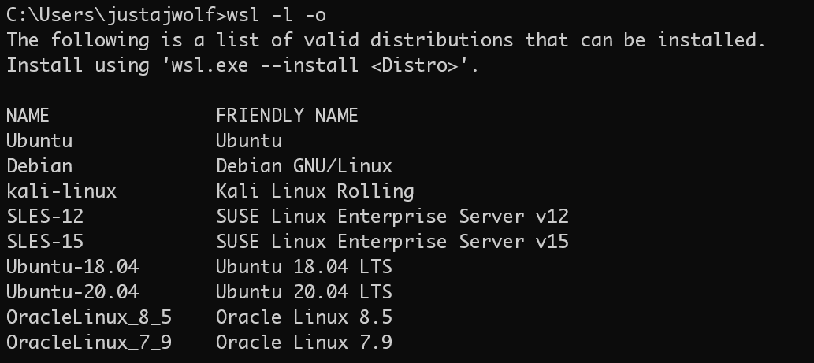
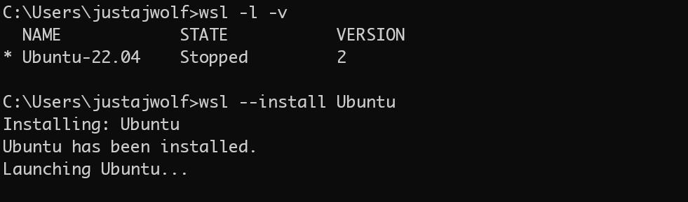
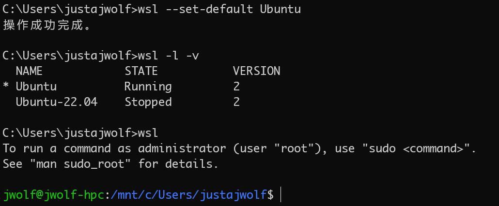
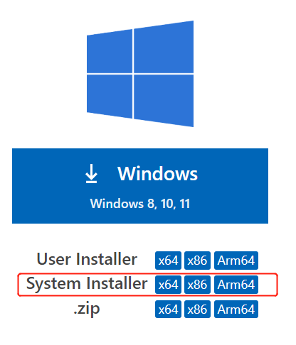
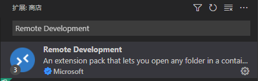
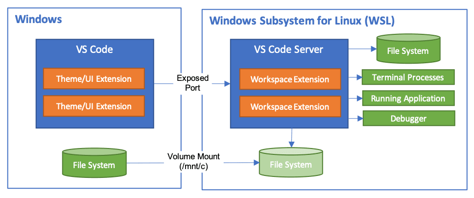
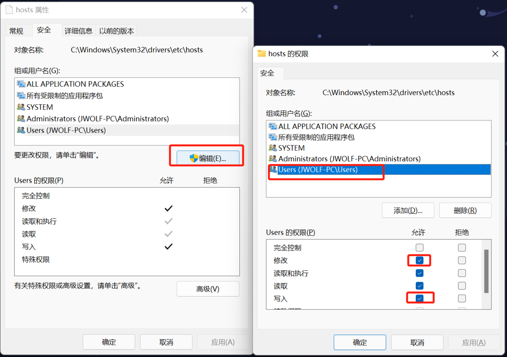

# Windows Subsystem for Linux (WSL)

> author: justajwolf

> 此篇内容，会随 wsl 更新，持续维护……

## 简单介绍

wsl 是 windows 下的 linux 子系统，于 Windows 10 中的某一个版本开始推出的。简单明了，就是一台电脑，同时运行两个系统，windows 是主系统，相当于把 linux 系统当成了一个应用，运行在 windows 上。

目前 wsl 有两个版本，[详细对比](https://learn.microsoft.com/zh-cn/windows/wsl/compare-versions)：

- wsl1：使用的不是一个完整的 Linux 内核，和 windows 系统在共用一套网关，能直接访问物理网卡，还不完整。
- wsl2：使用的是一个完整的 linux 内核，和 windows 父系统之间以及外网的交流，是通过一个叫 vEthernet (WSL)的虚拟网关来进行，自己是一个完全独立的系统。

此外 wsl 会使用 DriveFs 把 windows 系统下的硬盘挂载到下 linux 中/mnt 下，如：

- C 盘 => /mnt/c
- D 盘 => /mnt/d

关于 wsl 的快速介绍信息，[详见百科](https://baike.baidu.com/item/wsl/20359185?fr=aladdin)，更多详细信息，[官方文档](https://learn.microsoft.com/zh-cn/windows/wsl/)。

## 优点与槽点

**先说说，wsl 有哪些优点**：

- 对于用不惯 mac，以及 linux desktop(deepin，ubuntu desktop 等)的人来说，简直是一个不要太好的消息。又可以愉快蹦跶在 windows 这个大生态下，并且享受到 linux 环境一样的待遇。

- 我们可以划分区域，分而治之，就让它们各玩各的，相互隔离开来，简直不要太好。虽然即便没有 wsl，使用虚拟机也可以实现这种样子，但是使用虚拟机过程中有多少辛酸泪，懂得都懂，毕竟人家 windows 系统直接支持了，还不停的更新给你解决兼容和适配问题以及新内容，多好，还费啥劲去折腾虚拟机。

  - **生活区**：windows 环境，各种日常生活，再也不用担心去哪找兼容软件以及绿色软件。

  - **办公区**：liunx 环境，各种开发环境一应俱全安排上，这就是你的服务器环境，直接对着服务器环境开发，再也不用为因系统环境差异，所带来的各种时好时坏的编译兼容问题而抓耳挠腮，浪费本可以喝茶的时间。

- wsl 可以如 docker 导出镜像一样，导出一个整个 linux 发行版的备份文件。当你办公区环境配置好了，可以导出打包一个 tar 文件备份起来，在你任何时候想重装 windows 系统了，随便重装，完事就像还原系统一样，一个命令将 tar 导入就行，完事你的办公区就恢复原样了。

- wsl 会和 windows 硬盘数据共享。上面简介中有提到 windows 的硬盘会以 DriveFs 文件系统格式挂载到 linux 系统中的 /mnt 目录下，我们可以将开中产生的数据或者项目直接放在 windows 的其它数据盘上，通过/mnt 这个目录下的路径来直接进行访问和修改，就是重新装 wsl 或者并行安装其它的 linux 发行版，数据都是不需要来回迁移的，又省了漫长而又无聊的挪数据时间。

**前面真香了，现在罗列一下槽点**：

- 毕竟，本来一台电脑的资源，按照正常的搭配，一个系统跑起来肯定够，现在来跑俩系统，我们把一个系统当成应用，跑在另一个系统上，再怎么说多少内存总得加一加吧，整机配置不来个 32G 内存？你在 linux 子系统中跑 docker 试试看咋样。cpu 少给子系统分几个 processors，你试试跑起来是快还是慢。该加配置加配置吧，买本子的时候注意看 cpu 核数和频率，毕竟一机两用，台式主机就不多说了，随时升级。
- 上面说到数据共享这块，目前发现一个问题，就是数据访问修改时，数据变更可能会存在延迟问题，vscode 状态同步略微卡顿，毕竟跨文件系统，也都能理解。

  - 解决办法：创建一个虚拟磁盘，文件格式 ext4，挂载到 wsl 上用于存储数据，这样延迟问题应该会好很多。

上面这两点是目前用这么久以来，最直观的感受，当然任何东西它都不会完美，wsl 也存在我尚未遇到不好解决的恶心问题，毕竟微软的手笔，它们不也一直在更新和维护嘛。和我一样不喜欢用 mac 的 xdm，wsl 搞起来。

## 快速安装

- 这里是 [官方安装文档](https://learn.microsoft.com/zh-cn/windows/wsl/install)，介绍 wsl 相关安装步骤和注意事项。

- 这里是 [ubuntu 官方文档](https://ubuntu.com/tutorials/install-ubuntu-on-wsl2-on-windows-11-with-gui-support#1-overview)，介绍在 windows 的 wsl 上安装 Ubuntu 的图文步骤。

下面简单，介绍一下安装步骤。

> 关于 wsl 的相关命令，详见`wsl --help`

- 查看目前 wsl 发行版 linux，[github 数据](https://raw.githubusercontent.com/microsoft/WSL/master/distributions/DistributionInfo.json)。

  > 如果超时或者 dns 失败，找个域名查 ip 的网站，查下`raw.githubusercontent.com`解析之后的 ip，本地 hosts 配置一下，如：`185.199.109.133 raw.githubusercontent.com`

  

- 这块选择的是 Ubuntu，不带版本号，默认是 Ubuntu 的 lts 版本。

  > 这步安装完成，会启动 Ubuntu 初始化界面，就和初次安装 linux 系统一样，按步骤，设置用户名和密码，完事就安装成功，进入到 Ubuntu 中了。

  

- 到这 Ubuntu 子系统就安装好了，通过 wsl 进入到子系统。

  > 因为可以安装多个发行版，我们可以设置指定 Ubuntu 为 wsl 的默认发行版，如：`wsl --set-default Ubuntu`

  

到这 wsl 就安装完成了，你拥有了 windows 和 linux 两个系统环境，下面我们配置开发环境。

## vscode 安装(不用 vscode 的跳过)

- [vscode 下载](https://code.visualstudio.com/#alt-downloads)，注意下载 system 版本，使用中可操作的权限高。

  

- 安装远程开发工具，在插件商店，搜索：Remote Development，如下图：

  

- 这里引一个 vscode 远程开发的工作结构图，详见 [vscode 文档介绍](https://code.visualstudio.com/docs/remote/wsl)。

  

## 开发环境配置

### apt 源替换国内源([清华镜像站](https://mirror.tuna.tsinghua.edu.cn/help/ubuntu/))，以及安装常见工具包

> 这里要是 apt 安装包不慢，就不建议换其它镜像源了，默认镜像源的包会随系统更新，及时给出升级的，有些包升级，加速镜像源，不一定会有。

```bash
# 安装一下基本依赖包
$ sudo apt update
$ sudo apt install apt-transport-https ca-certificates

# 先备份一下官方镜像源地址
$ sudo cp /etc/apt/sources.list /etc/apt/sources.list.backup

# 这里用的是清华大学的镜像源
$ sudo sed -i "s@http://.*archive.ubuntu.com@https://mirrors.tuna.tsinghua.edu.cn@g" /etc/apt/sources.list
$ sudo sed -i "s@http://.*security.ubuntu.com@https://mirrors.tuna.tsinghua.edu.cn@g" /etc/apt/sources.list

# 更新本地的源索引
$ sudo apt update

# 安装常见构建基础库
$ sudo apt install build-essential

# 安装g++，安装nodejs需要编译的包使用
$ sudo apt install g++
```

### nodejs 环境配置

> 这里推荐使用 nvm，github 相关的托管文件链接，可以使用[jsdelivr](https://www.jsdelivr.com/)的 cdn 转一下方便快速访问，[详见](https://www.jsdelivr.com/github)。

nvm安装指南：[Install & Update Script](https://github.com/nvm-sh/nvm?tab=readme-ov-file#install--update-script)

```bash
# 这是用jsdelivr转换之后的url
$ curl -o- https://cdn.jsdelivr.net/gh/nvm-sh/nvm@v0.39.7/install.sh | bash

# 注意在~/.bashrc文件最后，加上这个环境变量，nvm下载nodejs的阿里镜像地址，nodejs官方源国内有时太慢
$ export NVM_NODEJS_ORG_MIRROR=https://npmmirror.com/mirrors/node

# 安装最新长期维护的版本/指定的版本，关于nvm的配置或者切换镜像源地址，这里不多写了
# 这里需要注意一点，应该是nvm脚本本身的特性吧，就lts是default的ailas
# 如果不修改ailas的default为你切换的node版本，新打开的终端不会生效，nvm use 只在当前终端进程生效
$ nvm install --lts
```

### docker 环境配置

> 我们选择安装 docker 的 server 版，这块需要关注 wsl 所安装的 linux 发行版本，[详见](https://docs.docker.com/engine/install/#server)，这里用的是 Ubuntu。

```bash
sudo apt-get update
# 安装其他依赖工具
$ sudo apt-get install ca-certificates curl gnupg lsb-release
# 添加docker的GPG key
$ sudo mkdir -p /etc/apt/keyrings
$ curl -fsSL https://download.docker.com/linux/ubuntu/gpg | sudo gpg --dearmor -o /etc/apt/keyrings/docker.gpg
# 配置docker本地的镜像源
$ echo \
  "deb [arch=$(dpkg --print-architecture) signed-by=/etc/apt/keyrings/docker.gpg] https://download.docker.com/linux/ubuntu \
  $(lsb_release -cs) stable" | sudo tee /etc/apt/sources.list.d/docker.list > /dev/null
# 更新本地所有镜像源的本地索引，包括刚加的docker
$ sudo apt-get update

# 有想安装指定docker版本的，可以先查看仓库中可用的版本list，添加指定版本
$ sudo apt-cache madison docker-ce
$ sudo apt-get install docker-ce=<VERSION_STRING> docker-ce-cli=<VERSION_STRING> containerd.io docker-compose-plugin

# 直接安装最新的
$ sudo apt-get install docker-ce docker-ce-cli containerd.io docker-compose-plugin

# 安装完之后，查看详情，会发先server没有启动
$ docker info

# 配置国内镜像源，下面是找的一个七牛云的公开地址，也可以更换其它的
$ mkdir -p /etc/docker
$ sudo tee /etc/docker/daemon.json <<-'EOF'
{
  "registry-mirrors": ["https://reg-mirror.qiniu.com"]
}
EOF

# 手动启动docker server端，这个可以选择配置自启动
$ sudo service docker start
$ docker info
```

> 关于`docker pull`私有镜像，需编辑 ~/.docker/config.json  加上如下配置：

```json
{
 "auths": {
  "registry.xxx.com": {
   "auth": "此处是私有访问token"
  }
 }
}
```

### 安装 mongosh

> 以下是快捷安装时，顺序执行的命令，更多[详见](https://www.mongodb.com/docs/mongodb-shell/install/)。

```bash
sudo apt-get install gnupg
wget -qO - https://www.mongodb.org/static/pgp/server-6.0.asc | sudo tee /etc/apt/trusted.gpg.d/server-6.0.asc
echo "deb [ arch=amd64,arm64 ] https://repo.mongodb.org/apt/ubuntu focal/mongodb-org/6.0 multiverse" | sudo tee /etc/apt/sources.list.d/mongodb-org-6.0.list
sudo apt-get update
sudo apt-get install -y mongodb-mongosh
```

## wsl 与 windows 相互访问配置

这块思路是给各自的 hosts 文件中配置一个固定的本地域名，使用脚本，动态维护 wsl 和 windows 的 ip，再各自环境使用固定域名完成访问。

> 这里使用的俩域名，wsl 的域名：wslhost，windows 的域名：winhost

这块配置完成之后，我们就可以在 windows 下，使用 wslhost 域名访问 wsl 中的任何服务了，同理 wsl 可以在 linux 中通过 winhost 域名访问任意 windows 下的服务(如 sock5 代理)。

### wsl -> windows 访问配置

> wsl 下动态维护/etc/hosts，更新配置 windows 父系统的 ip，方便 wsl 访问 windows。

- 给当前用户添加 root 用户组，这样会继承 root 用户组权限，完事给 hosts 文件加用户组的写权限

```bash
# 当前用户添加root用户组
$ sudo usermod -aG root $(id -un)

# 给hosts添加用户组写权限，保证root的用户组下的成员都能修改hosts
$ sudo chmod g+w /etc/hosts
```

- 创建脚本文件，配置 wsl 进入自执行(这块也可以配置成 wsl 开启启动，这块目前没这么做)。

```bash
# 创建脚本
$ tee ~/bash_config_wsl.sh <<-'EOF'
## 更新配置wsl下的hosts映射
# 先给hosts添加写权限
# sudo chmod a+w hosts
winip=$(ip route | grep default | awk '{print $3}')
winhost=$(echo $winip winhost)
echo $winhost
wincontent=$(cat /etc/hosts | grep winhost)
if [ "$wincontent" ]; then
    if [ "$wincontent" != "$winhost" ]; then
        cat /etc/hosts >/tmp/tmpwinhost
        sed -i "s/$wincontent/$winhost/g" /tmp/tmpwinhost
        cat /tmp/tmpwinhost >/etc/hosts
    fi 
else
    echo -e "\n$winhost" >>/etc/hosts
fi
EOF

# 配置登录wsl自动执行
$ echo -e "\. ~/.bash_config_wsl.sh" >> .bashrc
```

### windows -> wsl 访问配置

- 这块需要在 windows 下，先给 hosts 文件开放写权限，如下图：

)

- 创建更新 windows 下 hosts 的脚本，并配置 wsl 登录自动更新

```bash
# 创建脚本
$ tee ~/bash_config_win.sh <<-'EOF'
## 更新window下的hosts文件映射
wslip=$(echo $(ip addr show eth0 | grep inet | grep eth0 | cut -f 6 -d ' ' | cut -f 1 -d '/'))
wslhost=$(echo $wslip wslhost)
echo $wslhost
tmpwslhost="/tmp/tmpwslhost"
if [ ! -e $tmpwslhost ]; then
    echo $wslip >/tmp/tmpwslhost
fi
lastwslhost=$(echo $(sed -n '1p' $tmpwslhost))
if [ "$lastwslhost" ]; then
    if [ $wslip != $lastwslhost ]; then
        # 更新wsl的hosts配置
        cat /etc/hosts >/tmp/tmpwinhost
        sed -i "s/$lastwslhost/127.0.0.1/g" /tmp/tmpwinhost
        cat /tmp/tmpwinhost >/etc/hosts
        echo $wslip >/tmp/tmpwslhost

        # 更新windows的hosts
        cat /mnt/c/windows/system32/drivers/etc/hosts >/tmp/templastwinhosts
        sed -i "s/$lastwslhost/$wslip/g" /tmp/templastwinhosts
        cat /tmp/templastwinhosts >/mnt/c/windows/system32/drivers/etc/hosts
    fi
fi
EOF

# 配置登录wsl自动执行
$ echo -e "\. ~/.bash_config_win.sh" >> .bashrc
```

## FAQ

### 关于 ubuntu 22.04.1 出现 libcrypto.so.1.1 缺失问题

> 使用 mongo 时，跑测试时出现，[这是官方说明](https://www.mongodb.com/community/forums/t/ubuntu-22-04-and-mssing-libcrypto-so-1-1/168253)，这是 ubuntu 22 的软件包库还没支持。
> 可以使用如下方式，手动安装

点击[https://mirror.iranserver.com/ubuntu/pool/main/o/openssl](https://mirror.iranserver.com/ubuntu/pool/main/o/openssl)，搜索`libssl1.1_1.1.1l-1ubuntu1.2_amd64.deb`，右键复制下载地址

```bash
## 手动安装缺失的libcrypto.so.1.1
$ wget https://mirror.iranserver.com/ubuntu/pool/main/o/openssl/libssl1.1_1.1.1l-1ubuntu1.2_amd64.deb
$ sudo dpkg -i libssl1.1_1.1.1l-1ubuntu1.2_amd64.deb
```

### 关于 `占位程序接收到错误数据。 Error code: Wsl/Service/0x800706f7` 问题，进不去`wsl`的解决办法

错误信息如下：

```bash
占位程序接收到错误数据。
Error code: Wsl/Service/0x800706f7
```

解决办法，打开`管理员权限的cmd`，执行如下命令，重置`winsock`，不用重启电脑，完事再执行`wsl`即可。

```bash
netsh winsock reset
```
