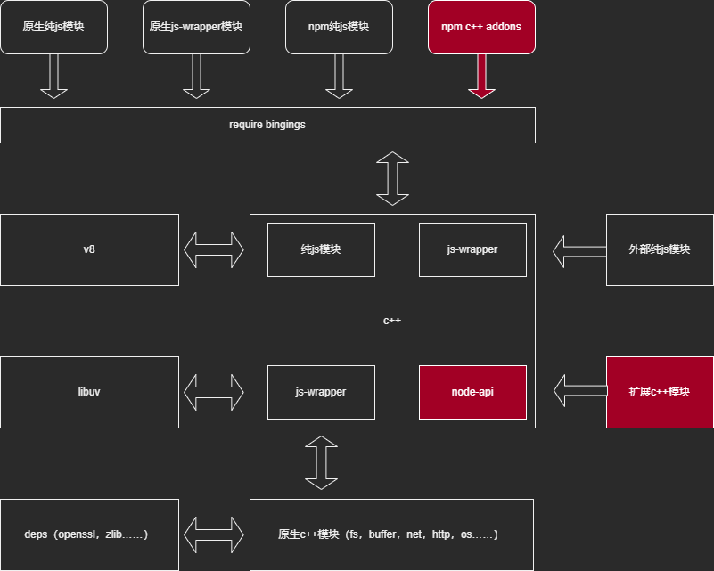

# Node.js 扩展N-API 和应用场景

>|||
>|:---|:---|
>|author|justajwolf|
>|timez|  UTC + 08:00|
>|ctime|  2024-07-29 10:11:00|
>|utime|  2024-08-13 22:32:00|

## 1 N-API 介绍

### 1.1 什么是 N-API？

N-API，这是最开始时的名字，现在也叫 Node-API，是专门用于构建 native nodejs 扩展模块的一组 api，在 nodejs 8.0.0 版本的时候引进的，并内置于 nodejs 内部，由官方自己维护。

在 N-API 之前，有一个 NAN（Native Abstractions for Node.js）的库，也是这么目的，但是有一些兼容问题和弊端，下面具体详说，N-API 算是对其的补充改善和提升吧。

N-API 主要作用于 nodejs 中 js 引擎和 C/C++ 代码之间，扮演的是一个桥梁的作用。

N-API 主要特点是，提供了可以直接操作和访问 js 对象的能力，开发者只管使用 api 即可。

就目前而言 nodejs 的 js 引擎是 v8， 在 N-API 另一侧这里的 C/C++ 代码，主要指的是 C/C++ 的扩展模块内容，也就是我们需要编写的代码部分。在这部分中，我们可以直接使用 N-API 去间接调用 v8 的 api 去操作和访问运行时的 js 对象，完成相应的交互。

### 1.2 N-API 的出现，优化了哪些问题，带来了哪些增强？

**1. 解决了因 nodejs 版本问题，导致扩展模块的前后兼容问题**

主要体现在，如下两点：

1. 如果使用纯原生方式，写一个扩展模块，因需要访问和操作 js 对象，就需要了解 js 引擎 api，就目前的 nodejs 而言，需要了解 v8 的 api，甚至说，了解 libuv 的 api。然后不同版本的 nodejs，可能存在 v8 版本的不一致，不同版本间的 v8 api 会出现废弃等问题，就会导致，我们提前编译好的扩展模块，使用的可能是旧的 v8 api，导致后续跨 nodejs 版本使用扩展模块，出现一些预期以外的兼容问题。

2. N-API 是由 nodejs 本身维护在内部的，它的 api 版本兼容是稳定的，因为扩展模块编译之后是二进制文件，所以 N-API 也是 ABI-stable，这里的 ABI 指的是 Application Binary Interface，也就是二进制接口稳定，所以我们只需要关注 N-API 版本和 nodejs 版本的兼容映射关系就可以了，一般来说，一次编译可以在好多版本下试用，无需重复编译。

> 这里贴一下，N-API 版本 和 nodejs 版本对应关系文档地址，[详见](https://nodejs.org/docs/latest/api/n-api.html#node-api-version-matrix)。

**2. 使用 N-API 的扩展模块，可以正常使用，可以无需关心 nodejs 的 js 引擎是否变化**

这个就很好理解，N-API 的出现，不再需要开发者，去了解具体的 js 引擎 api，它本身是一层 api 的抽象，我们通过它间接去调用 js 引擎的 api，下面都由每个版本的 nodejs 自己在内部衔接处理好。
哪天nodejs 偷偷更换了，比 v8 更好的 js 引擎了，我们也无需关心，我们的扩展代码是否能执行，属于无缝衔接。

**3. N-API 让 nodejs 跨语言集成变的更容易**

因为 N-API 是 ABI-stable 的，并且 nodejs 的扩展模块，编译之后的二进制文件，都是以 C style API 形式的动态链接库文件。

那么也就是说，只要是任何语言，能编译成 C style 类型的动态链接库，都可以使用 N-API，去为 nodejs，开发扩展模块。

nodejs 与 其它语言，甚至操作系统，他们之间的衔接的纽带，就是 C style 动态链接库，这样一来，很直接的一个使用场景，就有了，很多现成的动态链接库，我们不需要再用 js 去实现造一遍轮子了，仅使用 N-API 包装一下，就可以为 nodejs 所使用了。

## 2 如何使用 N-API，写一个nodejs addon，并发布使用？

这里先贴上，之前测试编译发布使用流程时，写的一个简单的 demo 详见，[代码仓库地址](https://github.com/justajwolf/node-addon-example)。

这个demo是导出一个`hello`的函数，打印 `hello_world~`，以这个 demo 为例，拆分开介绍一下，使用 N-API 编写一个 nodejs addon 和 中间一些工具链的配置，如何发布到npm，实际安装扩展的原理。

### 2.1 介绍一下 demo 的目录结构

```text
.
├── package.json                        
├── package-lock.json                   
├── .npmrc                              
├── binding.gyp                         使用的是 node-gyp 构建扩展模块，这里是当前项目的构建配置
├── build                               这是 node-gyp 构建完的输出目录，不需要用包含在发布的包中
├── lib                                 这里放需要包装native扩展的 js 代码，主要用于导出，以及放一些 .d.ts 的类型声明文件
│   ├── index.d.ts
│   ├── index.mjs
│   └── index.cjs                       
├── src                                 主要的 C/C++ 模块代码
│   ├── addon.h                         
│   ├── addon.cc                        具体addon的代码
│   └── main.cc                         注册扩展模块到 nodejs 上的代码
└── test                                
    └── test.mjs
```

### 2.2 介绍一些 binding.gyp 和 package.json 中的配置，以及如何发布 npm 包

**package.json**

```json
{   "scripts": {
        "recompile": "node-gyp build",
        "release": "npm publish",
        // "install": "node-gyp build",
        "test": "node test/test.mjs"
    },
    // 这个参数是npm默认支持的，当在执行npm install时，配置成true，会自动触发，当前包的编译，也就是执行 `node-gyp build` 命令
    // 如果在上面"scripts"中的显示指定了"install"命令，gypfile会被忽略掉，使用指定的代替, 如上面注释的"install"命令
    "gypfile": true,
    // 下面是兼容esm和cjs的默认导出
    "types": "./lib/index.d.ts",
    "main": "./lib/index.cjs",
    "exports": {
        "types": "./lib/index.d.ts",
        "default": {
            "require": "./lib/index.cjs",
            "import": "./lib/index.mjs"
        }
    },
    // 配置发布包时的包含文件
    "files": [
        "lib/**",
        "src/**",
        "binding.gyp",
        "test/**"
    ],
    // 发包配置，主要是给npm publish用的
    "publishConfig": {
        "access": "public",
        // 指定发布到npm上，也可以更换程github的地址
        "registry": "https://registry.npmjs.org"
    },
    // 这是用到的两个依赖包
    "dependencies": {
        // 这个是用来导入.node模块的包，它会自动在build目录下查找，我们编译好的.node文件，不用自己再写一个binding.js了
        "bindings": "^1.5.0",
        // 这个关键，这个包是对N-API的再度封装，也是由nodejs官方维护的，会比直接使用N-API更方便，后面会具体说
        "node-addon-api": "^8.1.0"
    }
}
```

**binding.gyp**

> 这个配置文件，默认放到和 package.json 平级目录下，当执行 `node-gyp build` 命令是，会自动读取当前配置。

```gyp
{
  "targets": [
    {
        # 当前构建模块名，对应到node-gyp中的宏定义是 NODE_GYP_MODULE_NAME
        "target_name": "node-addon-example",
        # 下面这两个是编译C/C++代码是的参数，这个参数是屏蔽掉底层的异常处理代码，下面代码出现异常时，往外抛，我们能在js代码中 catch
        "cflags!": [ "-fno-exceptions" ],
        "cflags_cc!": [ "-fno-exceptions" ],
        # 需要参与编译的源代码文件
        "sources": [ "./src/main.cc", "./src/addon.cc" ],
        # 需要参与编译的引用头文件目录，node-addon-api 是我们以来的一个包，里面包含我们需要编译时用的头文件
        "include_dirs": [
            "<!@(node -p \"require('node-addon-api').include\")"
        ],
        'defines': [ 
            # 这个宏定义和上面那个cflags一样，是给 node-addon-api 这个包用的
            'NAPI_DISABLE_CPP_EXCEPTIONS',
            # 这个宏定义，是声明 N-API的版本号，默认取的是 nodejs 构建时的配置参数 napi_build_version, 详见 `node -p process.config 中 napi_build_version 的值`
            "NAPI_VERSION=<(napi_build_version)",
        ],
    }
  ]
}
```

**发布和使用 npm 包**

关于发布：
    
基于上面介绍的 package.json 中的 `publishConfig` 和 `files` 配置，我们可以直接执行 `npm publish` 或者 `npm run release` 命令，直接发布到 npm 上即可，可以配置到 ci 上发布，关于ci的就不具体写了。

关于使用：

相同的是，就和使用正常的 npm 包一样，npm install <pkg>@<tag/version>即可。

不同的是，`npm install` 时会自动，执行 `node-gyp build` 根据包里面的 `binding.gyp` 配置文件，和当前 nodejs 的版本以及nodejs的编译配置信息，去编译当前扩展模块，输出到 `build` 目录中。

> 关于 nodejs 的 gyp 编译配置文件，详见命令：`node -p process.config`

> 关于 prebuild 扩展模块，这里先不提了，实时安装编译和使用prebuild，各有利弊，后面再对比说吧。

### 2.3 简单介绍一下 src 下面的代码流程

这个示例代码，我们用了 [`node-addon-api`](https://github.com/nodejs/node-addon-api) 这个包，它的头文件为 `napi.h`，不是 N-API 的 `node_api.h`，这里不过多介绍，后面会说。

```cpp
//----------------------------------------- main.cc -----------------------------------------
#include <napi.h>
#include "addon.h"

Napi::Object Init(Napi::Env env, Napi::Object exports)
{   
    // 在执行模块注册初始化时，往 exports 上挂载需要的导出内容
    MountExport(env, exports);
    return exports;
}

// 可以显示定义 NAPI_VERSION
// #define NAPI_VERSION 8

// 由 napi.h 提供的宏定义，注册当前模块给node
NODE_API_MODULE(NODE_GYP_MODULE_NAME, Init)

//----------------------------------------- addon.h -----------------------------------------
#ifndef TEST_JUST_A_J_WOLF_ADDON_H_
#define TEST_JUST_A_J_WOLF_ADDON_H_
#include <napi.h>

// 声明了一个 mountExport 函数，用于往 exports 挂载导出内容
void MountExport(Napi::Env env, Napi::Object exports);

#endif

//----------------------------------------- addon.cc -----------------------------------------
#include "addon.h"

// 定义了方法名和方法
const char *methodName = "hello";
Napi::String Method(const Napi::CallbackInfo &info)
{
    Napi::Env env = info.Env();
    return Napi::String::New(env, "hello_world~");
}

// mountExport 函数的具体实现
void MountExport(Napi::Env env, Napi::Object exports)
{   
    exports.Set(Napi::String::New(env, methodName), Napi::Function::New(env, Method));
};
```

## 3 nodejs 扩展模块，对我们来说，有哪些实用的应用场景？

1. 高性能计算：
    
    - 高精度计算：当需要处理大量数据或进行高精度计算时，C/C++ 的性能优势尤为明显。Node.js 的 addons 可以封装这些计算密集型任务，从而提高整体应用的性能。
    
    - 图像处理：处理大量图像或进行复杂的图像处理算法时，可以利用 C/C++ 的库（如libjpeg、OpenCV等）来加速处理过程。

2. 系统级操作：

    - 调用系统API：Node.js 的addons可以直接调用操作系统的 API，实现一些 Node.js 自身难以或无法完成的功能，如访问硬件资源、操作底层文件系统等。

    - 与第三方库集成：当 Node.js 没有合适的包或现有包的效率无法满足需求时，可以通过 addons 调用已有的 C/C++ 库来实现特定功能，如视频格式转换、加密解密等。

3. 多语言开发：

    - 跨语言互操作性：在多语言开发的项目中，Node.js 的 addons 可以作为桥梁，使 Node.js 能够调用 C/C++ 编写的类库，从而实现与其他语言（如Java、Python、Go等）的互操作。

    - 共享代码库：通过 addons，可以在不同的项目或不同语言之间共享 C/C++ 编写的代码库，提高代码复用性和开发效率。

4. 性能瓶颈优化：

    - 优化热点代码：对于 Node.js 应用中的性能瓶颈部分，可以通过编写 addons 来优化这些热点代码，从而提高整体应用的响应速度和吞吐量。

    - 并发处理：虽然 Node.js 本身擅长处理高并发，但在某些场景下（如需要处理大量 CPU 密集型任务时），通过 addons 可以利用 C/C++ 的多线程能力来进一步提高并发处理能力。

5. 游戏开发：

    - 游戏引擎集成：在游戏开发中，可能需要集成一些高性能的游戏引擎或物理引擎（这些引擎往往是用 C/C++ 编写的）。通过 Node.js 的 addons，可以方便地将这些引擎集成到 Node.js 应用中，从而利用 Node.js 的异步 IO 和网络通信能力来构建游戏的后端服务。


## 4 nodejs 的 addons 是什么？

Node.js 的 addons 是 Node.js 的原生扩展，是使用 C/C++ 编写的动态链接共享对象，显示为`.node` 后缀文件，它们可以通过 Node.js 的 require() 方法加载，并像其他普通的 Node.js 模块一样使用。

addons 的主要优势在于能够利用 C/C++ 的高性能特性，以及直接访问 系统级API 的能力，从而在某些场景下显著提升 Node.js 应用的性能或实现特定功能。

这里先介绍一下 nodejs 的组成结构，以及 addons 所处的位置和关系。

### 4.1 nodejs 的 组成结构，及 模块关系



### 4.2 nodejs 的 addons 的结构组成

这里引用一下官方文档中的一个纯 native 方式编写的代码示例：hello。

可以对比一下 上面 demo 中的 N-API 的使用方式，可以发现，纯原生 addon，少了一个封装的头文件 `node_api.h` 或者 `napi.h`。

有了上面的 demo 代码结构示例，再来快速瞅一下，纯 native 的结构，也就很容易理解了。

```c
// node 头文件
#include <node.h>

// 定义模块命名空间作用域
namespace demo {

// 引用 v8 api
using v8::FunctionCallbackInfo;
using v8::Isolate;
using v8::Local;
using v8::Object;
using v8::String;
using v8::Value;

// 具体扩展方法实现，这里直接使用的 v8 api
void Method(const FunctionCallbackInfo<Value>& args) {
  Isolate* isolate = args.GetIsolate();
  args.GetReturnValue().Set(String::NewFromUtf8(
      isolate, "world").ToLocalChecked());
}

// 模块初次load时，初始化方法
void Initialize(Local<Object> exports) {
   // 建立导出关系
   NODE_SET_METHOD(exports, "hello", Method);
}

// 注册扩展模块给node
NODE_MODULE(NODE_GYP_MODULE_NAME, Initialize)

}
```

简单说明一下，addons 的结构，主要分 3 部分：

1. 注册模块给 node，这里使用的是 node 中的宏定义，主要有三个，分别是

   - [NODE_MODULE](https://github.com/nodejs/node/blob/v20.13.1/src/node.h#L1257)

       - 这个宏定义，默认是注册到全局

   - [NODE_MODULE_INIT](https://github.com/nodejs/node/blob/v20.13.1/src/node.h#L1284-L1297)

       - 这个宏定义，在 `NODE_MODULE` 的基础之上，支持 `Context` 参数，支持用于上下文隔离，也就是多实例（跨线程）。

       - `NODE_MODULE_INIT` 是 `NODE_MODULE` 的 增强实现。
  
   - [NODE_MODULE_INITIALIZER](https://github.com/nodejs/node/blob/v20.13.1/src/node.h#L1284-L1297)
  
       - 这个宏定义，同 `NODE_MODULE_INITIALIZER` 作用一样，但是实现方式不一样。

2. node 初次加载 模块时的 初始化函数

   - `Initialize`

       - 这个函数是作为参数出现的，函数名不限制。

       - 示例用到了，另一个宏定义，[NODE_SET_METHOD](https://github.com/nodejs/node/blob/v20.13.1/src/node.h#L1058-L1086)，使用 node 封装的导出函数，导出对方法。

3. 具体 addons 的功能实现

   - 这里需要直接使用到 v8 的 api，来操作对象和参数了，因此需要我们，去了解下 [v8 相关的文档](https://v8docs.nodesource.com/)。

看完这个结构，也能感到 N-API 的其中一个作用，就是，集中抽象 api，降低开发 addon 的学习和维护成本。

### 4.3 nodejs 的模块加载机制，以及集成 addons 原理

**模块加载**：

1、对于 addons 模块的加载，node 提供了 [`process.dlopen`](https://nodejs.org/docs/latest-v20.x/api/process.html#processdlopenmodule-filename-flags) 函数，可用于直接加载 addons。

2、由于 addons 的模块，后缀名为 `.node`，不是标准的 es 模块，只是 nodejs 自己的扩展模块，所以，目前 `esm` 是不支持直接使用 `import` 进行加载的，可以自行使用 `process.dlopen` 来封装，下面贴一段，官方文档给的示例代码。

```mjs
import { dlopen } from 'node:process';
import { constants } from 'node:os';
import { fileURLToPath } from 'node:url';

const module = { exports: {} };
dlopen(module, fileURLToPath(new URL('local.node', import.meta.url)),
       constants.dlopen.RTLD_NOW);
module.exports.foo();
```

3、对于 `commonjs` 使用的 `require`，是支持加载 `.node` 模块的，下面贴一下 node 代码实现 和 [源码位置](https://github.com/nodejs/node/blob/v20.13.1/lib/internal/modules/cjs/loader.js#L1446-L1455)。

```js
/**
 * Native handler for `.node` files.
 * @param {Module} module The module to compile
 * @param {string} filename The file path of the module
 */
Module._extensions['.node'] = function(module, filename) {
  const manifest = policy()?.manifest;
  if (manifest) {
    const content = fs.readFileSync(filename);
    const moduleURL = pathToFileURL(filename);
    manifest.assertIntegrity(moduleURL, content);
  }
  // Be aware this doesn't use `content`
  return process.dlopen(module, path.toNamespacedPath(filename));
};
```

这里可以看到 `process.dlopen(module, path.toNamespacedPath(filename));`，这里也是直接使用了 `process.dlopen` 函数。与直接使用 `process.dlopen` 不同的是，我们不需要自己去构造参数，并且，也不需要自己去维护，模块的缓存，都交给了 `require`，来统一管理。

**集成 addons 原理**：

node 的扩展模块，后缀名是 `.node`，这个只是为了便于，node 加载模块时识别使用。

实际上的 `.node` 其实是一个 `动态链接库`：

- 在 linux 系统下时，是 `.so` 结尾

- 在 windows 系统下时，是 `.dll` 结尾

对于 `动态链接库` 的跨系统加载，主要依靠 `libuv` 的封装 api，进行系统级别的调用，来完成 `动态链接库` 的内容加载和调用。

node 完成的加载流程如下：

`require("xxx.node")` => `process.dlopen` => `C++层：DLOpen` => `系统层：dlopen`

## 5.nodejs addon 模块的所有编写方式

### 5.1 纯 native 写 addons

这个直接引用 `node.h` 头文件，以及 `v8.h`，等内置的 api 和 依赖库 api，直接写。

### 5.2 nan（Native Abstraction for Node.js）

贴一下 `nan` 的 [github 仓库](https://github.com/nodejs/nan)

这个是 nodejs 最早给出的，addons 实现方案，也是进行了少量的抽象和封装，但是还是需要了解 v8 相关api。

### 5.3 nodejs 提供 native 封装 => node-api

贴一下 `node-api` 的 [文档地址](https://nodejs.org/docs/latest-v20.x/api/n-api.html)

这个是目前，nodejs 推荐使用的 api，以前叫 `N-API`, 它隐层了很多 v8 和 node 层面内容, 定义了一组 C style API, 专门用于 addons 的 生成, 也就是生成 node扩展 `动态链接库` 的规范, 大家只需要关注 `node-api` 即可, 也减少了很多和 node 版本的 兼容性问题.

### 5.4 基于 node-api 的跨语言交互

#### C++

我们可以使用  node-addon-api  这个包，去获取需要的头文件：

- 仓库地址，[详见](https://github.com/nodejs/node-addon-api)。

- 文档地址，[详见](https://github.com/nodejs/node-addon-api/blob/main/doc/README.md)。

这个包代码不是 nodejs 的一部分，它是对  node-api 的扩展，是 C++ 基于 `N-API` 扩展的一个实现，用于更好的集成 C++ 代码，使 N-API 使用起来更方便。

#### Rust

我们也可以使用热门新秀语言：`rust`，去开发 nodejs 的 addon，主要使用的是这么一个库 `napi-rs`：

- 仓库地址，[详见](https://github.com/napi-rs/napi-rs)。

- 文档地址，[详见](https://napi.rs)。

这是一个 `rust` 版本的基于 `N-API` 的实现, `rust` 本身是可以编译成 `动态链接库` 的, 这个包遵循 `N-API` 的约定, 用于将 `rust` 代码, 生成 node 可以用的 `动态链接库`, 从而以 addons 的形式被 node 使用的目的.

> Rust 也是 js 的另一个运行时  Deno （Nodejs的兄弟）的核心开发语言，当初 Nodejs 作者，感觉到 Nodejs 的发展背离了初衷，主要是安全性问题，就重新写了 Deno，下层使用的是 Rust 和 V8，这可能是 Rust 支持 Nodejs 的一个原因吧，为了生态融合，去了解 [Deno](https://deno.com/) 的 api，会发现他们做了很多，与 Nodejs 兼容的东西。

这个库目前比较友好，相关的打包发布工具链也挺全的，一套代码, 可以支持同时构建成多个平台的`预编译版本`, 发布到 npm.

使用这个库，开发的相关包：

- `@swc/core` 用的就是 `rust-rs` 写的.

关于 `预编译版本`，说下明显的优缺点：

- `优点`: 提前通过 `ci` 等发布环境，提前编译好了，可能的系统环境下的 `.node` 包，`npm install` 时候不用再实时编译。

- `缺点`：每次安装时候，可能需要下载好几个，预编译的 `.node` 文件，时间挺长的。

    - 拿 `@swc/core` 来说，他会检测当前系统满足的 `.node`, 全都下载来。

`@swc` 用的就是 `rust-rs` 写的.

## 6.nodejs 扩展模块 和 纯 js 模块的优缺点

因为扩展模块，可以跨语言，这里先以 C++ 作为代表，简单从如下三方面来列下：

1.执行速度：
 
c++ 扩展通常具有更快的执行速度，因为 c++ 是编译型语言，其代码在执行前已经被编译成机器码，而 nodejs 中的 js 代码则是通过 v8 引擎即时编译（jit）的，中间会多一步编译的过程。在计算密集型任务中，c++ 扩展的优势尤为明显。

因为 nodejs 是单线程，除了这些任务外 —— timer 定时器任务(异步检查)，文件/网络io的数据读取任务(工作线程异步读取)，所有 js 代码还都是跑在主线程上，会阻塞主线程。

所以对于 js 计算任务，无论你是否使用 async/await 或 promise 去 wrapper 拆分，它总计算任务量是不变的，唯一的区别，就是将原本同一个时间点需要执行的大整块的长时间的任务，拆分成多个短时间的小任务，在不同的时间点串/并行执行，从而一定程度上提高任务承载能力，但是终究主线程是单线程，这种计算任务承载力是有限的。

就算使用 c++ 扩展模块也一样，只要是同步代码都是一样的，同步执行意味着串行和等待。但是在都不考虑使用工作线程的情况下，对于计算密集型任务 c++ 有语言上的优势。

此外，nodejs 提供了，工作线程模块 `worker_threads` 可以在 js 层面，显式的使用工作线程，去做计算型任务，每个线程是一个独立的 v8 实例，可以独立执行计算任务，不阻塞主线程。

另外 c++ 扩展也可以不占用主线程，在代码中利用 libuv 提供的下层工作线程，如同在 js 层面使用 `worker_threads` 一样，去异步工作。

无论是异步还是同步，对于计算行任务，同场景下来说，大多数情况下 c++ 执行速度是优于 js 的。

2.内存使用：

c++ 扩展通常能更有效地使用内存，因为它们可以直接操作内存地址，绕开了 js 对象，也避开 v8 引擎的js内存限制，因此不占用 v8 的内存限制指标。

这会帮助在 c++ 扩展中，处理复杂计算或大量数据时，内存使用更为便捷和高效。

弊端就是，内存管理不好，就容易OOM

> 注：nodejs 中的 buffer 数据也不会占用 v8 的内存指标，buffer 不是 v8 中的内容，是 nodejs 下层自己的 c++ 内置模块。

3.开发效率：

js 代码的开发效率通常更高，因为它具有更简洁的语法和丰富的库支持。
 
c++ 扩展的开发则相对复杂，需要更多的编译和调试工作，整体开发成本较高。

## 总结

1、N-API 是 nodejs 官方对外提供的一套统一的标准接口（有点类似于 open api 这种意思），api 很稳定，官方再 nodejs 内部维护，但凡遵循这套接口的定义，使用 N-API 开发的动态链接库，无论啥语言开发的，都可以为 nodejs 所使用，如同正常 js 模块一样。

2、N-API 也简化，开发 nodejs 扩展模块的流程，让我们可以将注意力，集中在 api 的使用上，而不是花一些时间去考虑各种兼容问题以及与 js 交互问题上，然后如需写扩展，可以优先考虑封装和抽象程度更高的这两个：

- 使用 C++ 的话，就 [`node-addon-api`](https://github.com/nodejs/node-addon-api) 这个包，可以参考最上面的 [`demo`](https://github.com/justajwolf/node-addon-example) 或者 [`sharp`](https://github.com/lovell/sharp) 这个库代码。

- 使用 Rust 的话，就 [`napi-rs`](https://github.com/napi-rs/napi-rs) 详细看下这个库的文档吧，文档将 N-API 映射到 Rust 自己的 api，以及一些数据类型映射，它的配套工具链挺完善，可以参考 [`swc-project/swc: Rust-based platform for the Web`](https://github.com/swc-project/swc)这个包代码。

3、N-API 最实用使用场景，就是 wrapper 现成的第三方库，快速为 nodejs 提供扩展能力，如 sharp 这个库。

4、对于 nodejs 正常开发任务 或者 优化代码，我们应该遵循能简单绝不复杂的原则，主要思路为 `提高整体承载能力` 和 `降低主线程的拥堵度` 两方面，优先考虑使用 js 代码。

- **提高整体承载能力**
  
  - 代码层面（脚本/项目）

    - 对于 js 计算任务，优先考虑，使用 async/await 或 promise 进行任务拆分，异步并行在主线程中执行。
      
      - 基本上这是平时大家用的最多的方式了。 
    
    - 需要再度优化了，可考虑 js 代码，使用 `wasm` 代替，编译之后也是二进制，浏览器中也能使用，目前主流浏览器都支持了 `WebAssembly`。
    
    - 最后再考虑引入 c++ 扩展。
  
  - node 层面
    
    - 考虑使用多个 node 进程启动 脚本/项目
      
      - `child_process`
      
      - `cluster` 
      
      - 第三方工具，如：`pm2` 
    
    - 再往大说，部署多容器，多机器。

- **降低主线程的拥堵度**

  - 优先考虑，使用 `worker_threads` 模块，丢给工作线程去跑。
    
    - 线程与进程共享内存，可以减少数据序列化和反序列化的开销。
    
    - c++ 扩展，可考虑，直接使用 N-API 的 `AsyncWorker`，使用工作线程异步执行。
  
  - 其次使用 `child_process` 模块，fork 子进程去跑。
    
    - 子进程与主进程完全隔离，它们通过 IPC 通信，开销代价高于 `worker_threads`。

最后总的来说，使用 nodejs 开发，也并不总是 c++ addons 就一定效率高，具体还需要结合具体业务和需要来决定，必要时也要需要一定的测试对比。
