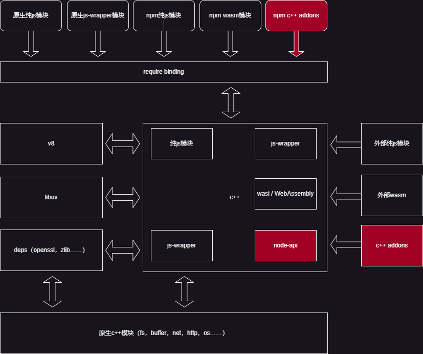

# Node.js 扩展N-API 和应用场景

>|||
>|:---|:---|
>|author|justajwolf|
>|timez|  UTC + 08:00|
>|ctime|  2024-07-29 10:11:00|
>|utime|  2024-07-29 10:11:00|

## 1 nodejs 扩展模块，对我们来说，有哪些实用的应用场景？
1. 高性能计算：
    - 高精度计算：当需要处理大量数据或进行高精度计算时，C/C++的性能优势尤为明显。Node.js的addons可以封装这些计算密集型任务，从而提高整体应用的性能。
    - 图像处理：处理大量图像或进行复杂的图像处理算法时，可以利用C/C++的库（如libjpeg、OpenCV等）来加速处理过程。
2. 系统级操作：
    - 调用系统API：Node.js的addons可以直接调用操作系统的API，实现一些Node.js自身难以或无法完成的功能，如访问硬件资源、操作底层文件系统等。
    - 与第三方库集成：当Node.js没有合适的包或现有包的效率无法满足需求时，可以通过addons调用已有的C/C++库来实现特定功能，如视频格式转换、加密解密等。
3. 多语言开发：
    - 跨语言互操作性：在多语言开发的项目中，Node.js的addons可以作为桥梁，使Node.js能够调用C/C++编写的类库，从而实现与其他语言（如Java、Python、Go等）的互操作。
    - 共享代码库：通过addons，可以在不同的项目或不同语言之间共享C/C++编写的代码库，提高代码复用性和开发效率。
4. 性能瓶颈优化：
    - 优化热点代码：对于Node.js应用中的性能瓶颈部分，可以通过编写addons来优化这些热点代码，从而提高整体应用的响应速度和吞吐量。
    - 并发处理：虽然Node.js本身擅长处理高并发，但在某些场景下（如需要处理大量CPU密集型任务时），通过addons可以利用C/C++的多线程能力来进一步提高并发处理能力。
5. 游戏开发：
    - 游戏引擎集成：在游戏开发中，可能需要集成一些高性能的游戏引擎或物理引擎（这些引擎往往是用C/C++编写的）。通过Node.js的addons，可以方便地将这些引擎集成到Node.js应用中，从而利用Node.js的异步IO和网络通信能力来构建游戏的后端服务。

## 2.nodejs 的 addons 是什么？

Node.js 的 addons，是 Node.js 的原生扩展，是使用 C/C++ 编写的动态链接共享对象（.node文件），它们可以通过 Node.js 的 require() 方法加载，并像其他普通的 Node.js 模块一样使用。

addons 的主要优势在于能够利用 C/C++ 的高性能特性，以及直接访问 系统级API 的能力，从而在某些场景下显著提升 Node.js 应用的性能或实现特定功能。

介绍 N-API 之前，这里先介绍一下 nodejs 的结构，以及 addons 所处的位置和关系。

### 2.1 nodejs 的 组成结构，及 模块关系



### 2.2 nodejs 的 addons 的结构组成

这里引用一下官方文档中的一个代码示例：hello。

```c
// node 头文件
#include <node.h>

// 定义模块命名空间作用域
namespace demo {

// 引用 v8 api
using v8::FunctionCallbackInfo;
using v8::Isolate;
using v8::Local;
using v8::Object;
using v8::String;
using v8::Value;

// 具体扩展方法实现，这里直接使用的 v8 api
void Method(const FunctionCallbackInfo<Value>& args) {
  Isolate* isolate = args.GetIsolate();
  args.GetReturnValue().Set(String::NewFromUtf8(
      isolate, "world").ToLocalChecked());
}

// 模块初次load时，初始化方法
void Initialize(Local<Object> exports) {
   // 建立导出关系
   NODE_SET_METHOD(exports, "hello", Method);
}

// 注册扩展模块给node
NODE_MODULE(NODE_GYP_MODULE_NAME, Initialize)

}
```

简单说明一下，addons 的结构，主要分 3 部分：

1. 注册模块给 node，这里使用的是 node 中的宏定义，主要有三个，分别是

   - [NODE_MODULE](https://github.com/nodejs/node/blob/v20.13.1/src/node.h#L1257)

       - 这个宏定义，默认是注册到全局

   - [NODE_MODULE_INIT](https://github.com/nodejs/node/blob/v20.13.1/src/node.h#L1284-L1297)

       - 这个宏定义，在 `NODE_MODULE` 的基础之上，支持 `Context` 参数，支持用于上下文隔离，也就是多实例（跨线程）。

       - `NODE_MODULE_INIT` 是 `NODE_MODULE` 的 增强实现。
  
   - [NODE_MODULE_INITIALIZER](https://github.com/nodejs/node/blob/v20.13.1/src/node.h#L1284-L1297)
  
       - 这个宏定义，同 `NODE_MODULE_INITIALIZER` 作用一样，但是实现方式不一样。

2. node 初次加载 模块时的 初始化函数

   - `Initialize`

       - 这个函数是作为参数出现的，函数名不限制。

       - 示例用到了，另一个宏定义，[NODE_SET_METHOD](https://github.com/nodejs/node/blob/v20.13.1/src/node.h#L1058-L1086)，使用 node 封装的导出函数，导出对方法。

3. 具体 addons 的功能实现

   - 这里需要直接使用到 v8 的 api，来操作对象和参数了，因此需要我们，去了解下 [v8 相关的文档](https://v8docs.nodesource.com/)。

### 2.3 nodejs 的模块加载机制，以及集成 addons 原理

**模块加载**：

1、对于 addons 模块的加载，node 提供了 [`process.dlopen`](https://nodejs.org/docs/latest-v20.x/api/process.html#processdlopenmodule-filename-flags) 函数，可用于直接加载 addons。

2、由于 addons 的模块，后缀名为 `.node`，不是标准的 es 模块，只是 nodejs 自己的扩展模块，所以，目前 `esm` 是不支持直接使用 `import` 进行加载的，可以自行使用 `process.dlopen` 来封装，下面贴一段，官方文档给的示例代码。

```mjs
import { dlopen } from 'node:process';
import { constants } from 'node:os';
import { fileURLToPath } from 'node:url';

const module = { exports: {} };
dlopen(module, fileURLToPath(new URL('local.node', import.meta.url)),
       constants.dlopen.RTLD_NOW);
module.exports.foo();
```

3、对于 `commonjs` 使用的 `require`，是支持加载 `.node` 模块的，下面贴一下 node 代码实现 和 [源码位置](https://github.com/nodejs/node/blob/v20.13.1/lib/internal/modules/cjs/loader.js#L1446-L1455)。

```js
/**
 * Native handler for `.node` files.
 * @param {Module} module The module to compile
 * @param {string} filename The file path of the module
 */
Module._extensions['.node'] = function(module, filename) {
  const manifest = policy()?.manifest;
  if (manifest) {
    const content = fs.readFileSync(filename);
    const moduleURL = pathToFileURL(filename);
    manifest.assertIntegrity(moduleURL, content);
  }
  // Be aware this doesn't use `content`
  return process.dlopen(module, path.toNamespacedPath(filename));
};
```

这里可以看到 `process.dlopen(module, path.toNamespacedPath(filename));`，这里也是直接使用了 `process.dlopen` 函数。与直接使用 `process.dlopen` 不同的是，我们不需要自己去构造参数，并且，也不需要自己去维护，模块的缓存，都交给了 `require`，来统一管理。

**集成 addons 原理**：

node 的扩展模块，后缀名是 `.node`，这个只是为了便于，node 加载模块时识别使用。

实际上的 `.node` 其实是一个 `动态链接库`：

- 在 linux 系统下时，是 `.so` 结尾

- 在 windows 系统下时，是 `.dll` 结尾

对于 `动态链接库` 的跨系统加载，主要依靠 `libuv` 的封装 api，进行系统级别的调用，来完成 `动态链接库` 的内容加载和调用。

node 完成的加载流程如下：

`require("xxx.node")` => `process.dlopen` => `C++层：DLOpen` => `系统层：dlopen`

## 3.nodejs 提供的所有实现 addons 的 api

### 3.1 native 实现 addons => nan(Native Abstraction for Node.js)

贴一下 `nan` 的 [github 仓库](https://github.com/nodejs/nan)

这个是 nodejs 最早给出的，addons 实现方案，也是进行了少量的抽象和封装，但是还是需要了解 v8 相关api。

### 3.2 nodejs 提供 native 封装 => node-api

贴一下 `node-api` 的 [文档地址](https://nodejs.org/docs/latest-v20.x/api/n-api.html)

这个是目前，nodejs 推荐使用的 api，以前叫 `N-API`, 它隐层了很多 v8 和 node 层面内容, 定义了一组 C style API, 专门用于 addons 的 生成, 也就是生成 node扩展 `动态链接库` 的规范, 大家只需要关注 `node-api` 即可, 也减少了很多和 node 版本的 兼容性问题.

### 3.3 基于 node-api 的跨语言交互

**c++ 实现**:

[文档地址](https://github.com/nodejs/node-addon-api/blob/main/doc/README.md)

贴一下仓库地址: [node-addon-api](https://github.com/nodejs/node-addon-api)


这是一个基于 `node-api` 又再次封装的一个包, 用于集成 c++ 代码, 不需要太关心 v8 等底层 api 以及 node 版本问题, 只管使用 `node-api`.

**rust 实现**:
[文档地址](https://napi.rs/)

贴一下仓库地址: [napi-rs](https://github.com/napi-rs/napi-rs).

这是一个 `rust` 版本的基于 `node-api` 的实现, `rust` 本身是可以编译成 `动态链接库` 的, 这个包遵循 `node-api` 的约定, 用于将 `rust` 代码, 生成 node 可以用的 `动态链接库`, 从而以 addons 的形式被 node 使用的目的.

这个库目前比较友好, 一套代码, 可以支持同时构建成多个平台的编译版本, 发布到 npm.

`@swc` 用的就是 `rust-rs` 写的.

## 4 如何 快速动手 写一个 nodejs addon？

这里贴一个 demo 仓库: [node-addon-examples](https://github.com/nodejs/node-addon-examples/tree/main)

这个仓库 demo, 涵盖了, 上面说的所有 版本 node api 实现.